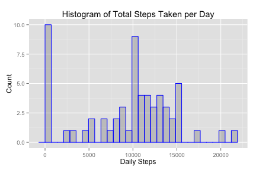

## Loading and preprocessing the data

1. Load the data (i.e. read.csv())

```r
library(data.table)

zip_file <- "activity.zip"
data_file <- "activity.csv"

if (!file.exists(data_file)) {
    unzip(zip_file)
} 

activityDF <- read.csv(data_file, header=TRUE)
```

2. Process/transform the data (if necessary) into a format suitable for your analysis
    + Transform data into a data.table for processing efficiency

```r
activityDT = data.table(activityDF)
```

## What is mean total number of steps taken per day?

1. Make a histogram of the total number of steps taken each day

```r
library(ggplot2)

dailyStepsDT = activityDT[, sum(steps, na.rm=TRUE), by=date]
setnames(dailyStepsDT, "V1", "steps")

g <- ggplot(data=dailyStepsDT, aes(x=steps))
g + geom_histogram(alpha=.20, colour="blue") +
    labs(title="Histogram of Total Steps Taken per Day") +
    labs(x="Daily Steps", y="Count")
```

 

2. Calculate and report the **mean** and **median** total number of steps taken per day
* **Mean:**

```r
mean1 <- round(mean(dailyStepsDT$steps, na.rm=TRUE))
mean1
```

```
## [1] 9354
```
* **Median:**

```r
median1 <- median(dailyStepsDT$steps, na.rm=TRUE)
median1
```

```
## [1] 10395
```

## What is the average daily activity pattern?

1. Make a time series plot (i.e. type = "l") of the 5-minute interval (x-axis) and the average number of steps taken, averaged across all days (y-axis)


```r
avgStepsDT = activityDT[, mean(steps, na.rm=TRUE), by=interval]
setnames(avgStepsDT, "V1", "avg_steps")

g <- ggplot(data=avgStepsDT, aes(x=interval, y=avg_steps))
g + geom_line(colour="red") +
    labs(title="Avg Steps Taken per Interval (across all days)") +
    labs(x="5-Min Interval", y="Avg Steps Taken")
```

 

2. Which 5-minute interval, on average across all days in the dataset, contains the maximum number of steps?
    + **Interval:**

```r
max_steps <- max(avgStepsDT$avg_steps)
avgStepsDT[avg_steps == max_steps][,interval]
```

```
## [1] 835
```

## Imputing missing values

There are a number of days/intervals where there are missing values (coded as NA). The presence of missing days may introduce bias into some calculations or summaries of the data.

1. Calculate and report the total number of missing values in the dataset (i.e. the total number of rows with **NA**s)
    + **Total number of missing values:**

```r
sum(is.na(activityDT$steps))
```

```
## [1] 2304
```

2. Devise a strategy for filling in all of the missing values in the dataset. The strategy does not need to be sophisticated. For example, you could use the mean/median for that day, or the mean for that 5-minute interval, etc.
    + **Chosen strategy:** fill in missing values (where steps = NA) with the mean for that 5-minute interval across all days

3. Create a new dataset that is equal to the original dataset but with the missing data filled in.

```r
activityDF_2 <- activityDF

for (i in 1:nrow(activityDF_2)) {
    if (is.na(activityDF_2$steps[i])) {
        j <- activityDF_2$interval[i]
        activityDF_2$steps[i] <- as.integer(avgStepsDT[interval==j,][,avg_steps])
    }
}

activityDT_2 = data.table(activityDF_2)
```

4. Make a histogram of the total number of steps taken each day and calculate and report the **mean** and **median** total number of steps taken per day. Do these values differ from the estimates from the first part of the assignment? What is the impact of imputing missing data on the estimates of the total daily number of steps?


```r
dailyStepsDT_2 = activityDT_2[, sum(steps), by=date]
setnames(dailyStepsDT_2, "V1", "steps")

g <- ggplot(data=dailyStepsDT_2, aes(x=steps))
g + geom_histogram(alpha=.20, colour="blue") +
    labs(title="Histogram of Total Steps Taken per Day") +
    labs(x="Daily Steps", y="Count")
```

 

* **Mean:**

```r
mean2 <- round(mean(dailyStepsDT_2$steps))
mean2
```

```
## [1] 10750
```
* **Median:**

```r
median2 <- median(dailyStepsDT_2$steps)
median2
```

```
## [1] 10641
```
* **Mean/Median comparison to first part:**

```r
if (mean2 != mean1 | median2 != median1) {
    cat("Mean or Median is different!\n")
} else {
    cat("Mean and Median are the same!\n")
}
```

```
## Mean or Median is different!
```
* **Impact of imputing missing data on the estimates of the total daily number of steps:**

```r
cat("Mean difference: ", mean2 - mean1, "; Median difference: ", median2 - median1, "\n")
```

```
## Mean difference:  1396 ; Median difference:  246
```

## Are there differences in activity patterns between weekdays and weekends?

1. Create a new factor variable in the dataset with two levels - "weekday" and "weekend" indicating whether a given date is a weekday or weekend day.

```r
weekend_days <- c("Saturday", "Sunday")
activityDF_2$day_class <- "weekday"

for (i in 1:nrow(activityDF_2)) {
    if (weekdays(as.POSIXlt(activityDF_2$date[i])) %in% weekend_days) {
        activityDF_2$day_class[i] <- "weekend"
    }
}

activityDF_2$day_class <- as.factor(activityDF_2$day_class)
activityDT_3 = data.table(activityDF_2)
```

2. Make a panel plot containing a time series plot (i.e. type = "l") of the 5-minute interval (x-axis) and the average number of steps taken, averaged across all weekday days or weekend days (y-axis).

```r
avgStepsDT_2 = activityDT_3[, mean(steps), by="interval,day_class"]
setnames(avgStepsDT_2, "V1", "avg_steps")

library(lattice)
xyplot(avg_steps ~ interval | day_class, data=avgStepsDT_2, type="l",
       main="Avg Steps Taken per Interval (across all days)",
       xlab="5-Min Interval", ylab="Avg Steps Taken",
       layout=c(1,2))
```

 
